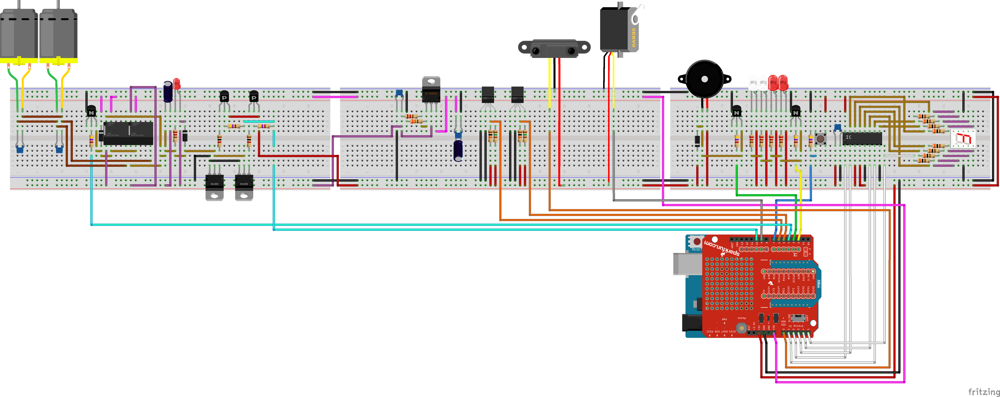

troolebot
=========

Arduino based autonomous or radio controlled robot

## Hardware ##

* Arduino Uno (or 328p based)
* XBEE Shield
* XBEE module
* A lot of varied components

Fritzing schematic, see ``brd/`` folder.

## Software ##

Arduino program, see ``src/`` folder.
